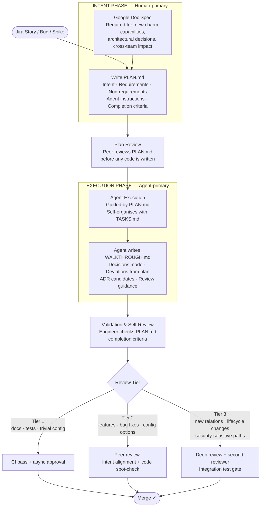

# Agent-First Workflow: Synthesis & Recommended Strategy

**Team:** Platform Engineering — American Squad  
**Context:** Building Juju charms for Canonical's internal and community-operated services  
**Status:** v2 — Updated with team context corrections and design refinements  
**Source brainstorms:** [Workflow Architect](../workflow-architect/report.md) · [Tooling & Infrastructure](../tooling-infrastructure/report.md) · [Transition Strategy](../transition-strategy/report.md)

---

## Team Context

Platform Engineering American squad builds and maintains **open-source Juju charms** for:
- **IS Infrastructure team** — who operate Canonical's internal infrastructure
- **Community teams** (Matrix, Discourse, MediaWiki) — where PFE builds the charm but IS operates the deployed service

This shapes several important constraints:

- Charm repos are **public** — no infra-specific details can live in them; environment-specific config belongs in operator-side overlays
- Code quality is **publicly visible** — open-source standards apply
- Work covers a wide range: new charm features, significant **compliance upkeep** across many owned charms, and **new workloads charmed every cycle**
- All charms have **unit tests and integration tests** — staging environment testing (edge→stable promotion) is a near-future goal, not yet implemented
- Story estimation is in **engineering hours** (original estimate + actual effort tracking) — this is kept as-is
- The team is **mostly new joiners** arriving over the coming weeks — an ideal moment to establish norms from day one
- The transition must be **substantially complete within 6 months**, with full team adoption from the start

The review bar must remain high: broken charms affect internal users and community-operated services. But the blast radius is not immediate production infrastructure — it is mediated by IS operators and deployment pipelines.

---

## Part 1: Brainstorm Report Highlights

Three models independently brainstormed this problem. Their strongest contributions:

| Report | Model | Best Contribution |
|---|---|---|
| [Workflow Architect](../workflow-architect/report.md) | Claude Opus 4.5 | End-to-end process map, PLAN.md template, role evolution, risk catalogue |
| [Tooling & Infrastructure](../tooling-infrastructure/report.md) | GPT-5.4 | GitHub workflow, Jira adaptations, agent skills architecture, AI review pipeline |
| [Transition Strategy](../transition-strategy/report.md) | Claude Sonnet 4.5 | 12-month arc, onboarding program, co-design workshops, red flags |

All three agreed on: PLAN.md as the central artifact, tiered review, PR stacks to manage review volume, co-design over mandate, and skills before orchestration agents. The synthesis below incorporates the best of all three, corrected for PFE's actual context.

---

## Part 2: The Agent-First Workflow

### Core Loop



### Phase Descriptions

#### Intent Phase

The engineer owns this phase entirely. Two paths depending on the scope of work:

**When to write a Google Doc Spec first:**
- Introducing new charm capabilities or relations that affect how IS or community teams operate a service
- Architectural decisions affecting multiple charms or shared libraries
- Process changes requiring cross-team input or alignment
- Any work requiring approval before implementation starts (per PR001)

**When PLAN.md alone is sufficient:**
- Bug fixes with a clear reproduction case
- Compliance upkeep and dependency bumps within existing patterns
- New config options or action handlers following established patterns
- Refactoring that does not change charm behaviour
- Test coverage improvements

The PLAN.md is **immutable once reviewed** — it is the reviewed contract between the engineer and the agent. If execution reveals the plan needs significant revision, stop, update the plan, and re-review before continuing.

#### Agent Execution Phase

The agent receives the approved PLAN.md as its primary context, along with repo-level context files (see [Context Infrastructure](#context-infrastructure) below). It then:

1. Creates **TASKS.md** — its own implementation checklist, self-organised from the PLAN.md. This is the agent's working notes, not a reviewed artifact. It lets the engineer see progress and where the agent is in a session.
2. Implements guided by PLAN.md, updating TASKS.md as it proceeds.
3. On completion, writes **WALKTHROUGH.md** — a handoff document for the engineer and reviewer.

The engineer's role during execution is active steering: injecting additional context mid-session, catching early drift, making rollback decisions, and managing sessions.

#### Validation & Self-Review Phase

Before opening a PR, the engineer independently verifies the agent's output against the PLAN.md completion criteria. This is not a formality — it is the most important quality gate the engineer owns. Specifically for charm work:

- Run unit tests and verify new behaviour is tested
- Run integration tests locally if the change touches event handling, relations, or config
- Check that no infra-specific detail has leaked into the public repo
- Confirm WALKTHROUGH.md is present and complete

#### Peer Review (Tiered)

| Tier | Applies to | What reviewers check | Gate |
|---|---|---|---|
| **1** | Docs, test additions, trivial config, dependency bumps | CI pass is sufficient; async lightweight approval | Any team member, async |
| **2** | Features, bug fixes, new config/action handlers, compliance updates | Intent alignment, WALKTHROUGH.md, code spot-check for agent-typical errors | One peer, within 1 business day |
| **3** | New relations or interfaces, lifecycle handler changes, security-sensitive paths, changes affecting IS or community team operations | Full code review, second reviewer, integration test pass | Two reviewers; sync session recommended |

**Tier assignment:** Self-assigned by the engineer opening the PR, based on the criteria above. Any reviewer may escalate to the next tier — escalation is not a criticism, it is a quality signal.

---

## Part 3: The Three Key Artifacts

### PLAN.md — The Contract

Written by the engineer, reviewed by a peer, immutable during execution. The quality of this document is the primary determinant of agent output quality.

```markdown
---
jira: PE-XXXX
summary: One-line description of the work
issue_type: Story | Bug | Spike
spec: https://... (link to Google Doc spec if applicable)
owner: name@canonical.com
charm: charm-name
review_tier: 1 | 2 | 3
risk_note: Optional — note any non-obvious risks
---

## Summary
What are we building or fixing, and why. 2–3 sentences maximum.

## Context
### Codebase Orientation
- Primary files: list the files most relevant to this work
- Relevant Juju concepts: which events, relations, config options are affected
- Existing patterns to follow: "In this charm we handle X by doing Y"

### Requirements
Precise and testable. Each requirement should be independently verifiable.
1. When [Juju event occurs], the charm must [do specific behaviour]
2. Config option [name] must [validate / default / behave as]
3. [Any other specific, testable requirement]

### Non-Requirements
- NOT changing: [adjacent systems or charms to leave untouched]
- Out of scope: [related work explicitly excluded]
- Constraints: [e.g., must remain backward compatible with ops/model X]

## Implementation Guidance
High-level approach and key implementation decisions. Not line-by-line pseudocode — leave room for the agent to find the best path.

Anticipated files to change:
| File | Change type |
|------|-------------|
| `src/charm.py` | Modify — add handler for [event] |
| `tests/unit/test_charm.py` | Update — new test cases for [scenario] |

## Agent Instructions
- Follow the coding conventions in `AGENTS.md`
- No new Python dependencies without explicit approval noted here
- All event handlers must include error handling and structured logging
- Tests must use the `ops.testing.Harness` framework
- Pause and surface to the engineer before: modifying relation interfaces, making changes outside the anticipated file list, if a requirement seems ambiguous

## Completion Criteria
- [ ] All unit tests pass (`tox -e unit`)
- [ ] Lint clean (`tox -e lint`)
- [ ] Integration tests pass if this change touches event handling or relations
- [ ] No infra-specific details present in any changed file
- [ ] WALKTHROUGH.md written and included in the PR
```

**What makes a PLAN.md fail:**
- *Too vague:* "Improve error handling" — agent makes assumptions, produces plausible but wrong output
- *Too prescriptive:* Line-by-line pseudocode — removes the agent's ability to find better solutions; the engineer did the hard work anyway
- *Missing constraints:* Not stating backward compatibility, public API stability, or "leave charm X alone" — agent optimises for stated goals and breaks unstated ones

### TASKS.md — The Agent's Scratchpad

Created by the agent at the start of execution. Not reviewed or committed. Gives the engineer visibility into the agent's self-organised plan and progress.

```markdown
# TASKS — PE-XXXX

Generated from PLAN.md by agent at [timestamp].

## Implementation Steps
- [x] Read PLAN.md and orient in codebase
- [x] Identify affected files and existing patterns
- [ ] Implement event handler in src/charm.py
- [ ] Write unit tests covering happy path and error cases
- [ ] Verify lint passes
- [ ] Write WALKTHROUGH.md

## Open Questions
- [Anything the agent is uncertain about, surfaced to engineer]
```

### WALKTHROUGH.md — The Handoff Document

Written by the agent upon completing implementation. Committed with the PR. Serves two audiences: the reviewing peer (review context) and the team's knowledge base (learnings, ADR candidates).

```markdown
# WALKTHROUGH — PE-XXXX

## What Was Done
Summary of changes made, referencing PLAN.md requirements.

## Decisions Made
| Decision | Rationale | Alternative considered |
|---|---|---|
| Used X approach for Y | Because Z was already established in the codebase | Could have used W, but it would require... |

## Deviations from PLAN.md
Any places where the implementation differs from what the PLAN.md anticipated, and why.

## How to Test
Exact commands to verify the change works as intended:
```
tox -e unit
tox -e integration -- -k test_name
```

## Suggested Follow-ups
- [ ] ADR candidate: [decision that should be recorded for the team]
- [ ] Context improvement: [something missing in AGENTS.md or codebase docs that would help future agents]
- [ ] Potential story: [related work observed but out of scope]
```

---

## Part 4: Tooling and Infrastructure

### Context Infrastructure (Do in Week 1)

Every active charm repo should gain these files. They are the primary mechanism by which agents understand the codebase without requiring lengthy prompts.

**`AGENTS.md`** (in each charm repo root):
- Task routing: what kinds of tasks agents should and should not take on in this repo
- Charm-specific coding conventions (event handler structure, logging style, test patterns)
- Key files and their purpose
- Known gotchas and non-obvious constraints
- Validation commands (`tox -e unit`, `tox -e lint`, `tox -e integration`)
- Explicit: "Do not include infra-specific details in any committed file"

**`.github/copilot-instructions.md`** (team-wide or per repo):
- Universal coding standards that apply across all PFE charms
- Link to team PLAN.md template
- Review tier assignment guidance

**`docs/charm-architecture.md`** (per repo, where it doesn't already exist):
- Juju model: which relations this charm provides and requires, key events, config options
- Key design decisions and why they were made
- How to run a meaningful integration test locally

These files should be the first PR any new engineer opens. Writing them is itself a learning exercise.

### GitHub Workflow

**Branching convention:**
```
feat/PE-XXXX-short-description     ← human-owned umbrella branch
stack/PE-XXXX-01-core-handler      ← first agent-generated slice
stack/PE-XXXX-02-tests             ← second slice
stack/PE-XXXX-03-docs              ← third slice
```

**PR stacks:** Use [`gh-stack`](https://github.com/timwaters/gh-stack) (GitHub CLI extension, available now). GitHub's native stacked PRs feature is in beta — the team is on the waiting list and will migrate when it becomes available. PR stacks are not mandatory for every story — use them when agent work naturally decomposes into reviewable slices:

- 1 PR: Tier 1 or small Tier 2 work
- 2–4 stacked PRs: Normal Tier 2/3 feature delivery
- 5+ PRs in a stack: Consider whether the scope needs a spec and design split first

**PR template** (`.github/pull_request_template.md`):

```markdown
## Jira
PE-XXXX

## PLAN.md
[link to PLAN.md in repo, or paste path]

## Change summary
What this PR does (1–3 sentences).

## Review guidance
Where should reviewers focus? What is the highest-risk part of this change?

## Validation
Commands run and their outcomes:
- `tox -e unit`: ✅
- `tox -e lint`: ✅
- `tox -e integration` (if applicable): ✅ / ⏭ not applicable for this change

## Agent metadata
- Generated-by: GitHub Copilot CLI
- Model: [e.g., claude-sonnet-4.6]
- Agent usage: generated | assisted | human-only
```

**GitHub labels** (add these — no new custom fields needed initially):
- `agent:generated` — majority of implementation done by agent
- `agent:assisted` — agent used for parts; human wrote substantial portions
- `tier:1` / `tier:2` / `tier:3` — review tier for this PR

### Jira

**Estimation:** Keep engineering hours as-is (original estimate + effort tracking). In an agent-first world, the original estimate reflects **human hours** — planning, orchestration, review — not total calendar time. As the team calibrates, estimates will naturally compress for implementation-heavy stories while remaining stable for design/orchestration-heavy work. Track the delta; share it as a team learning signal.

**Planning phase visibility:** The right answer is a new **"Planning"** Jira workflow status that appears as a distinct column on the sprint board. This is the recommended approach — advocate with your Jira admin. In the interim while that is being set up, use a `phase:planning` label applied to any issue where PLAN.md is being written. This is filterable on the board and removes the need for any custom fields.

**Minimal Jira changes (start with just these):**

| Change | Type | Purpose |
|---|---|---|
| `Planning` status | Workflow status (new) | Sprint board visibility for issues in PLAN.md phase |
| `phase:planning` label | Label | Interim visibility until new status is available |
| `agent:generated` / `agent:assisted` | Labels | Carried over from PR labels; retrospective analysis |

That is it for now. Add more only when a specific reporting need cannot be met by the above.

### Agent Skills

The goal for the first 6 months is to establish the **workflow**, not to build a comprehensive skill library. Resist the urge to build many skills upfront — they require maintenance, drift as the codebase evolves, and distract from the core adoption.

**Start with the two skills that directly enable the workflow:**

1. **PLAN.md Reviewer** — Given a PLAN.md, identify: missing requirements, ambiguous instructions, likely failure modes, missing context. Output a structured review the engineer can act on before handing off to the agent. This is the skill that raises the floor of plan quality across the team.

2. **WALKTHROUGH.md Writer** — Given a completed implementation diff + original PLAN.md, generate a well-structured WALKTHROUGH.md. This ensures the handoff document exists even on tight timelines.

Once those are stable and in use, evaluate what to build next based on observed friction — not based on a pre-planned list.

---

## Part 5: Transition Strategy

### The 6-Month Arc — Full Team from Day One

The team is mostly new joiners arriving soon. This is the right time to establish norms — there are no existing habits to break. The workflow definition is presented as a Google Doc for team review and input **before** it is adopted, so the team can shape it and own it from day one.

```mermaid
gantt
    title PFE Agent-First Transition — 6 Months
    dateFormat MM
    axisFormat Month %m

    section Foundation
    Google Doc review & team input    :01, 3w
    Infrastructure setup              :01, 2w
    Team alignment workshops          :01, 3w

    section Early Adoption
    All stories use workflow          :02, 8w
    PR stacks piloted                 :02, 4w
    Review tiers in operation         :02, 8w
    Onboarding program live           :02, 8w

    section Maturation
    PLAN.md library growing           :04, 8w
    AI pre-review piloted             :05, 4w
    Workflow retrospective & refine   :03, 12w

    section Institutionalisation
    Internal playbook published       :06, 2w
    Learnings shared with company     :06, 2w
```



### Month 1: Alignment and Setup

The workflow is not handed down — the team reads the Google Doc and shapes it. This month is about alignment, not adoption.

**Week 1:**
- Manager shares Google Doc workflow definition; team has 3 business days to comment, question, propose changes
- All-team session (2h): discuss feedback, resolve open questions, agree on the workflow the team will adopt
- Assign 2 engineers to set up infrastructure this week (see Quick-Win list below)

**Week 2:**
- Workshop: Co-create the team's PLAN.md template (refine the base template to match PFE charm conventions)
- Write the first `AGENTS.md` for 1–2 active charm repos (pair exercise)
- First volunteer stories using the workflow while setup continues

**Weeks 3–4:**
- All new stories started with the workflow (PLAN.md before any code)
- Daily 2-minute "agent learnings" share in standup
- End-of-month Show & Tell: 2-3 engineers share a PLAN.md + agent output + what worked/didn't
- Retrospective: What needs changing in the workflow before Month 2?

**Quick-win infrastructure (Weeks 1–2, ~1 day of work total):**
- [ ] PR template in all active charm repos
- [ ] GitHub labels: `agent:generated`, `agent:assisted`, `agent:human`, `tier:1`, `tier:2`, `tier:3`, `phase:planning`
- [ ] `AGENTS.md` in 2–3 most active repos
- [ ] `.github/copilot-instructions.md` (team-wide)
- [ ] PLAN.md template committed to a shared location (team wiki or dedicated repo)
- [ ] `#pfe-agent-first` Mattermost channel
- [ ] Jira: request `Planning` status from admin; apply `phase:planning` label as interim
- [ ] Install `gh-stack` in local environments

### Months 2–3: Workflow as Normal

By Month 2, the workflow is the team's normal operating mode. No more "experiments" — this is how PFE works.

**What this looks like in practice:**
- Every Story and Spike starts with a PLAN.md
- PLAN.md peer review happens before agent execution (lightweight for Tier 1, more thorough for Tier 2-3)
- PR stacks used for medium/large work as engineers get comfortable with `gh-stack`
- Review tiers are self-assigned; escalation is normalised and destigmatised
- WALKTHROUGH.md is present in every PR

**Metrics being collected passively:**
- PR labels give agent involvement data (`agent:generated`, `agent:assisted`)
- Review tier labels give tier distribution
- Jira `phase:planning` label duration gives planning phase visibility (until proper status arrives)
- Engineering hours (already tracked) vs. story estimates — track the delta and discuss in retrospectives

**Retrospective cadence:** Every pulse, dedicate 10 minutes to "agent workflow health" — what worked, what slowed us down, what to change. This is the primary mechanism for evolving the workflow.

### Months 4–6: Maturation and Institutionalisation

**Month 4–5:**
- PLAN.md library has enough entries to be genuinely useful — new engineers can study real examples
- AGENTS.md files are maintained and up-to-date across all active repos
- AI pre-review piloted on one repo (GitHub Copilot code review, or a GitHub Action wrapping the Copilot CLI `/review` command)
- Review culture has evolved: reviewers asking "is the intent correct?" before "is the code correct?"

**Month 6:**
- Team publishes an internal **"PFE Agent-First Playbook"** — concrete, honest, includes failures and what was learned
- Team presents at a Canonical engineering forum or all-hands
- New joiners onboard directly into the workflow (after manual charm building phase)
- Retrospective: Has velocity increased? Has defect rate held? How has human hours per story changed?

### New Joiner Onboarding

New joiners joining PFE need operational understanding of the Juju model before agent-first patterns will be safe or meaningful. The manual phase is not optional.

**Weeks 1–3: Manual Foundation**
- Build one complete charm manually, with limited AI assistance (explanation OK, code generation discouraged for core logic)
- Pair with an experienced team member on a real bug or feature
- Deep focus: Juju lifecycle, events, relations, Harness testing
- Deliverable: Working charm + write-up in the team's own words explaining the charm model
- Comprehension check (informal conversation, not an exam): "Walk me through what happens when this charm loses its relation to X"

**Weeks 4–6: Supervised Agent-First**
- Write first PLAN.md with a mentor reviewing it before execution
- Run the agent-first workflow end-to-end on one low-risk story
- Co-review an agent-generated PR with the mentor
- Contribute a small improvement to the charm's `AGENTS.md`

**Week 7+: Independent**
- Full team member, operating the workflow independently
- Mentors the next new joiner through the manual foundation phase

---

## Part 6: Risk Management

### Risk 1: Hallucinated Charm Logic That Passes Tests

**What happens:** Agent generates a lifecycle handler that looks correct in Harness unit tests but behaves incorrectly in a real Juju model (wrong event sequencing, incorrect relation data handling).

**Mitigations:**
- Tier 3 review required for all lifecycle and relation interface changes
- PLAN.md must explicitly enumerate which Juju events are affected and what the expected behaviour is
- Integration tests are a Tier 3 gate, not optional for these changes
- Post-incident focus: "What context was missing in the PLAN.md?" — not "who approved this?"

### Risk 2: New Joiners Lack Operational Depth

**What happens:** Engineer completes onboarding, ships several agent-first stories, but cannot debug a real Juju incident or participate meaningfully in architectural discussions.

**Mitigations:**
- Manual foundation phase is 3 weeks minimum — do not compress under schedule pressure
- The comprehension check at the end of the manual phase is the gate to agent-first work
- "Agent autopsy" sessions: when agent produces wrong charm logic, the team debugs together to find what was missing in the PLAN.md or AGENTS.md
- Debugging rotation: engineers take turns triaging real Juju issues without agent assistance

### Risk 3: Review Queue Overwhelm

**What happens:** Agent-generated PRs arrive faster than reviewers can keep up; review quality drops or reviewers burn out.

**Mitigations:**
- PR stacks keep individual diffs small and focused
- Tiered review means not everything needs the same attention
- PLAN.md review as a pre-implementation gate: good plans lead to cleaner implementations, which are faster to review
- Track review queue age (Tier 2 PRs waiting > 1 business day is a signal); discuss in pulse retrospective

### Risk 4: PLAN.md Becomes a Ritual, Not a Tool

**What happens:** Engineers write PLAN.md because they have to, not because they find it useful. Quality is low; agent output is correspondingly poor; the workflow feels like overhead.

**Mitigations:**
- Show & Tell sessions make great PLAN.mds visible and celebrated
- PLAN.md review (peer feedback) surfaces quality issues early
- Manager checks correlation between PLAN.md quality and agent output quality — make this visible
- If PLAN.mds are systematically shallow, that is a workflow design problem, not an individual failure

### Risk 5: Infra-Specific Details Leaking into Public Repos

**What happens:** Agent includes environment-specific config, internal hostnames, or IS-specific details in committed code because it was present in the conversation context.

**Mitigations:**
- AGENTS.md must explicitly state: "Do not include infra-specific details in any committed file"
- Add this as a checklist item in the PLAN.md completion criteria and the Validation phase
- Make it a Tier 3 escalation trigger if reviewers spot any infra-specific content in a PR

---

## Part 7: Open Decisions for the Team

Resolve these in Month 1 workshops — do not decide them unilaterally:

1. **Where do PLAN.md files live?** In each charm repo under `.plans/PE-XXXX.md`? Or in a shared planning repo? The in-repo option is simpler and keeps context near the code.

2. **What is the PLAN.md peer review process for Tier 1 work?** Is a peer review required before any agent execution, or is self-review sufficient for clearly low-risk work?

3. **How do we handle multi-charm stories?** One PLAN.md with sub-sections per charm, or one PLAN.md per charm? The former is simpler; the latter gives cleaner per-repo context.

4. **Agent sessions and TASKS.md persistence** — is TASKS.md committed to the branch for visibility, or kept ephemeral (only exists during the session)? Committing it adds traceability; keeping it ephemeral reduces noise.

5. **Tier escalation norms** — when a reviewer believes a PR should be Tier 3 but the author assigned Tier 2, what is the process? Agree on this explicitly to avoid friction.

6. **How do we track staging test results** (edge→stable) when that pipeline exists? What does it mean for the review tier of a story? Worth designing the placeholder now even though the pipeline isn't built yet.

---

## Conclusion

The workflow is the easy part. The team building genuine shared ownership of it is the hard part.

The team is in a uniquely good position: new joiners arriving with no existing habits to break, a manager who wants to co-design rather than mandate, and a realistic timeline. The Google Doc review process before adoption is the right first move — it signals from day one that this is the team's workflow, not a directive.

**North star for 6 months:** Every engineer can say: "I understand our charm codebase well enough to catch agent mistakes. I know how to write a PLAN.md that produces good results. I spend my time on the work that matters — design, validation, review — rather than on mechanical implementation."

**Principles to return to when things get hard:**
1. Co-design over mandate — the team shaped this; they own it
2. Manual depth before agent speed — onboarding sequence is not negotiable
3. PLAN.md quality is the leverage point — invest in getting it right
4. Review is now the primary engineering craft
5. Failures are curriculum — agent mistakes are how expertise is built
6. Be an honest forerunner — share the struggles, not just the wins

---

*Update this document after the Month 1 team workshop, and at the Month 3 and Month 6 retrospectives.*

**Source brainstorm reports:**
- [`../workflow-architect/report.md`](../workflow-architect/report.md) — Claude Opus 4.5
- [`../tooling-infrastructure/report.md`](../tooling-infrastructure/report.md) — GPT-5.4
- [`../transition-strategy/report.md`](../transition-strategy/report.md) — Claude Sonnet 4.5
